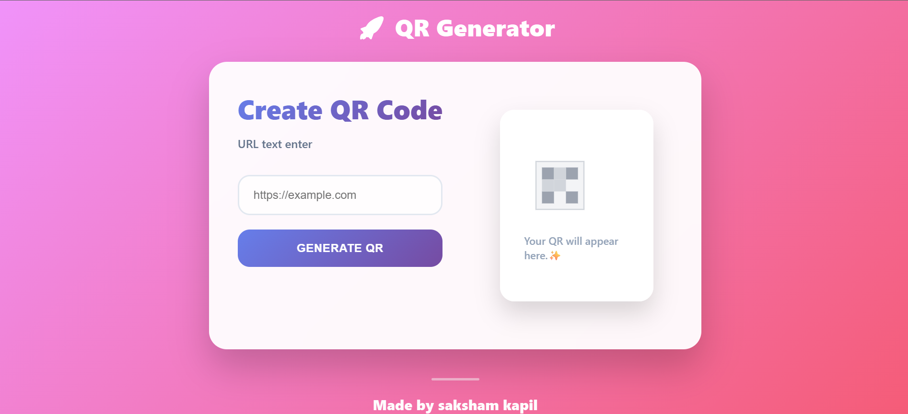

# 🚀 Advanced QR Code Generator

A simple, fast, and responsive QR Code Generator built using **HTML, CSS, and JavaScript**. This tool allows you to instantly generate and download a QR code for any URL or text.

## ✨ Features
* **Real-time Generation:** The QR code is generated instantly as you type your text or URL.
* **Download Option:** Easily download your generated QR code as a high-quality image.
* **Responsive Design:** Works perfectly on all devices, including mobile and desktop.
* **Clean UI:** Simple, modern, and user-friendly interface for the best experience.

## 🛠️ Tech Stack
* **Frontend:** HTML5, CSS3, JavaScript
* **API/Library:** [qrcode.js](https://davidshimjs.github.io/qrcodejs/)

## 🌐 Live Demo
You can view the live project here:
👉 [https://sakshamkapil1244.github.io/qr-code-generator/](https://sakshamkapil1244.github.io/qr-code-generator/)

## 📸 Screenshots

👤 Author
Saksham kapil
GitHub: https://github.com/sakshamkapil1244

LinkedIn: https://www.linkedin.com/in/saksham-kapil-790b16298

